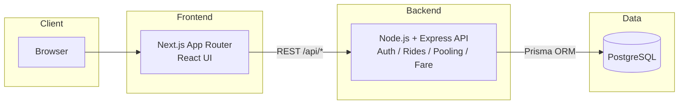
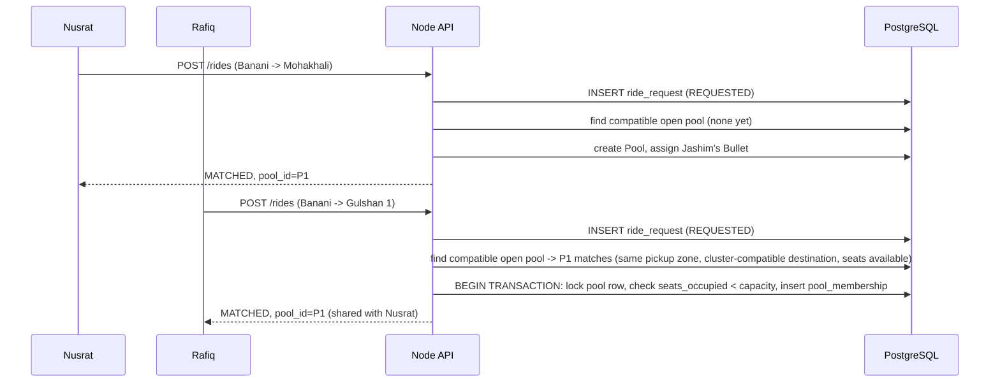

# Architecture — Dhaka Tesla Pool

## System Overview

## Why this shape

- **Next.js (App Router)** — server-rendered pages for passenger/driver dashboards, file-based routing, easy deployment on free tiers (Vercel).
- **Express** — minimal, well-understood REST layer. No need for GraphQL's flexibility on an MVP with a handful of well-known resources.
- **PostgreSQL** — the domain is fundamentally relational (users → vehicles → rides → pool membership → fares), and we need real constraints (foreign keys, capacity checks, unique indexes) that a document store would push into application code.
- **Prisma** — type-safe queries, migrations tracked in git, decent transaction API (needed for the concurrency problem in Section 14 of the brief).
- **No microservices / queues / Redis** — single Node process is enough for an MVP with a handful of actors. Would revisit at scale (see `docs/scaling-bonus.md`).

## Request flow example (ride pooling)

## Layers & responsibility

| Layer | Responsibility |
|---|---|
| Frontend (Next.js) | Auth forms, ride request form, live status view, driver dashboard, pool view. No business logic — only calls API and renders state. |
| Backend (Express) | All business rules: matching, capacity enforcement, fare calc, state transitions, auth, validation. |
| Database (Postgres) | Source of truth. Constraints (FKs, CHECK on capacity, unique pool_membership) as a second line of defense against bugs in application logic. |
