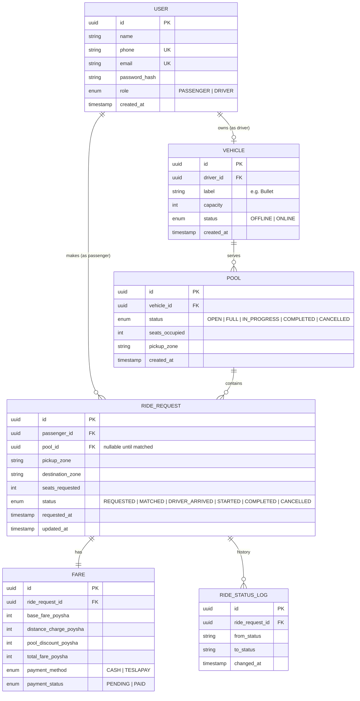

# ERD — Dhaka Tesla Pool

## Key constraints (enforced in DB, not just app code)

- `VEHICLE.capacity` — CHECK (capacity > 0)
- `POOL.seats_occupied <= VEHICLE.capacity` — enforced via transaction (see `docs/concurrency.md`), and a DB CHECK as a second line of defense
- `RIDE_REQUEST.pool_id` — nullable FK; only set once matched
- Unique constraint on (`ride_request_id`) in `FARE` — one fare row per ride
- `USER.phone` and `USER.email` — unique, used for login

## Why these tables and not fewer

- `RIDE_STATUS_LOG` is separate from `RIDE_REQUEST.status` so we keep full history ("hold onto enough history to explain exactly what happened" — Section 2 of the brief) without overloading the ride row itself.
- `FARE` is its own table (not columns on `RIDE_REQUEST`) so each passenger's fare is independently queryable/auditable, and so a pool of 3 requests cleanly has 3 fare rows against 1 pool.
